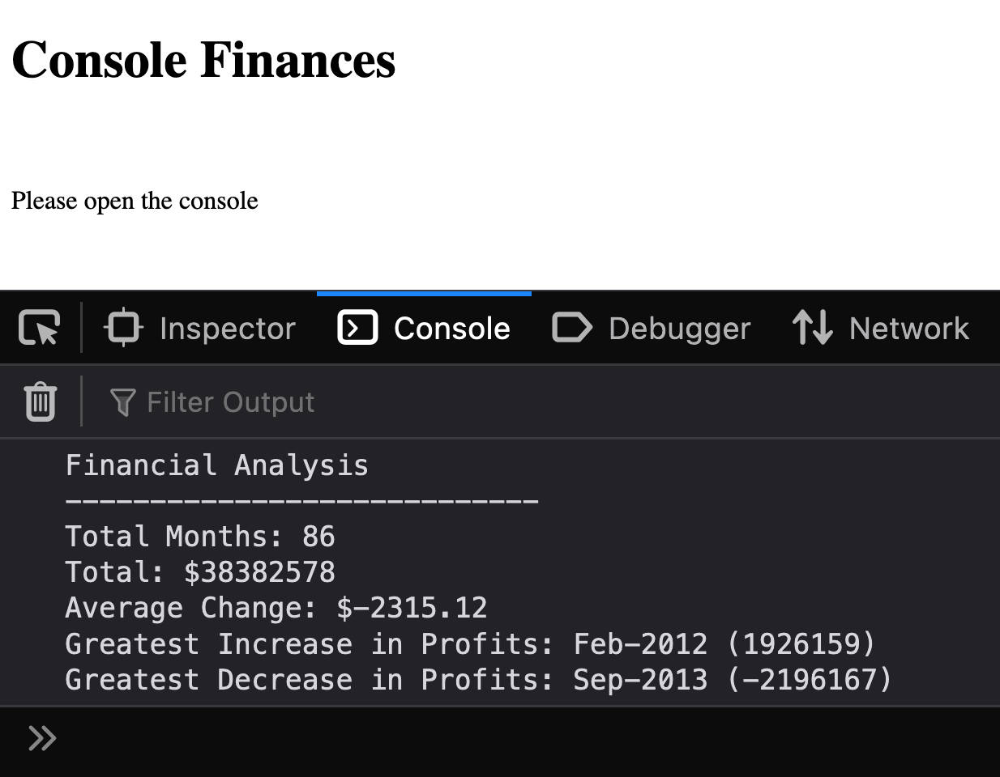

# Console-Finances

## Description

**Front-End Web Development Bootcamp - Module 4 Challenge**

This activity presents a real-world situation: creating code for analyzing the financial records of a company. The financial dataset was provided - this program will display the results of analysis of these records to the console.

## Installation

No need to install, simply visit:  **WEBPAGE**

## Usage

Having visited ___________________, right click on anywhere on the webpage, and choose inspect element (Chrome/Mozilla Firefox).  Go to the 'Console' tab and you will see the Financial Analysis.

**SCREENSHOT**

   

## Credits

University of Birmingham - Front-End Web-Dev Bootcamp

## License

MIT License

Copyright (c) [2022] [Richard Brain]

Permission is hereby granted, free of charge, to any person obtaining a copy
of this software and associated documentation files (the "Software"), to deal
in the Software without restriction, including without limitation the rights
to use, copy, modify, merge, publish, distribute, sublicense, and/or sell
copies of the Software, and to permit persons to whom the Software is
furnished to do so, subject to the following conditions:

The above copyright notice and this permission notice shall be included in all
copies or substantial portions of the Software.

THE SOFTWARE IS PROVIDED "AS IS", WITHOUT WARRANTY OF ANY KIND, EXPRESS OR
IMPLIED, INCLUDING BUT NOT LIMITED TO THE WARRANTIES OF MERCHANTABILITY,
FITNESS FOR A PARTICULAR PURPOSE AND NONINFRINGEMENT. IN NO EVENT SHALL THE
AUTHORS OR COPYRIGHT HOLDERS BE LIABLE FOR ANY CLAIM, DAMAGES OR OTHER
LIABILITY, WHETHER IN AN ACTION OF CONTRACT, TORT OR OTHERWISE, ARISING FROM,
OUT OF OR IN CONNECTION WITH THE SOFTWARE OR THE USE OR OTHER DEALINGS IN THE
SOFTWARE.

---

## Features

This code performs and displays financial analysis of a set of hard-coded financial records.  The project in its current state is not feature-rich.

## How to Contribute

All of the computational code would work with any array of months and profit/loss in the following: [["string", number],["string", number]...] - so an obvious improvement would be to create an interface that would accept other arrays of financial information and return the analysis.  Why not take a branch and see what you can do...?

